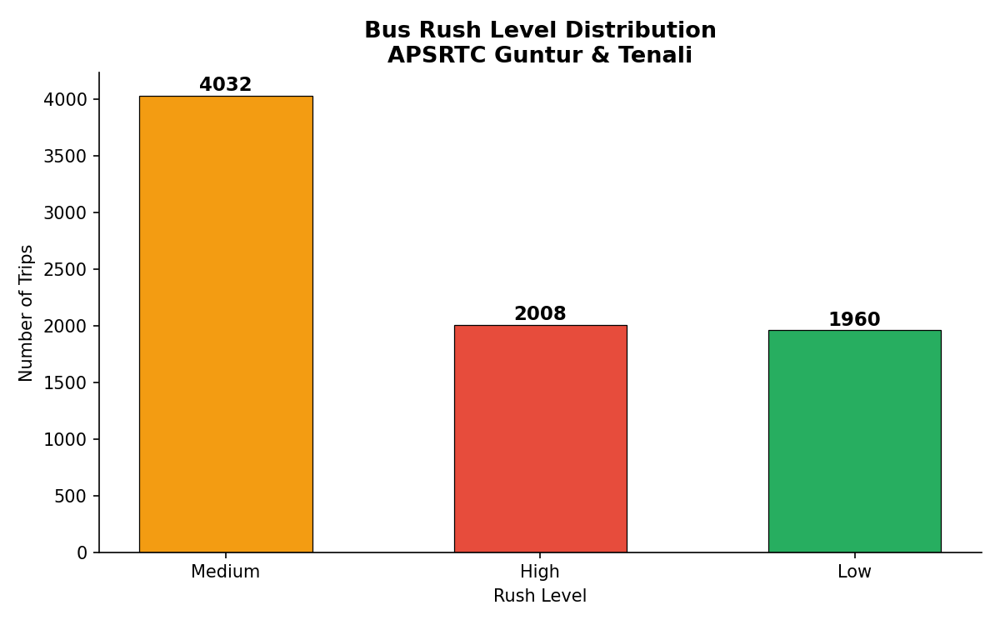
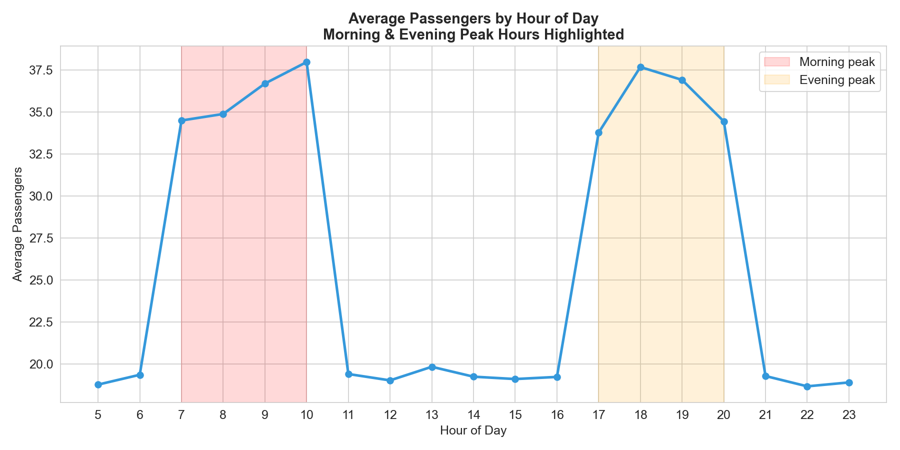
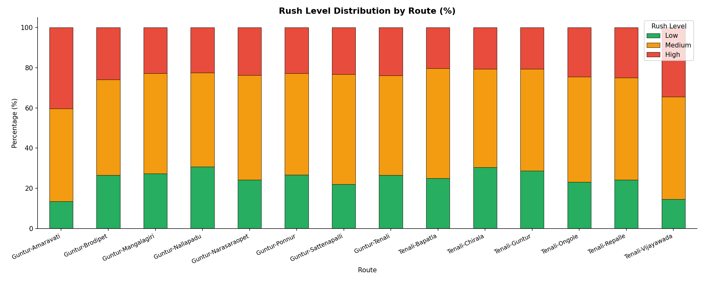
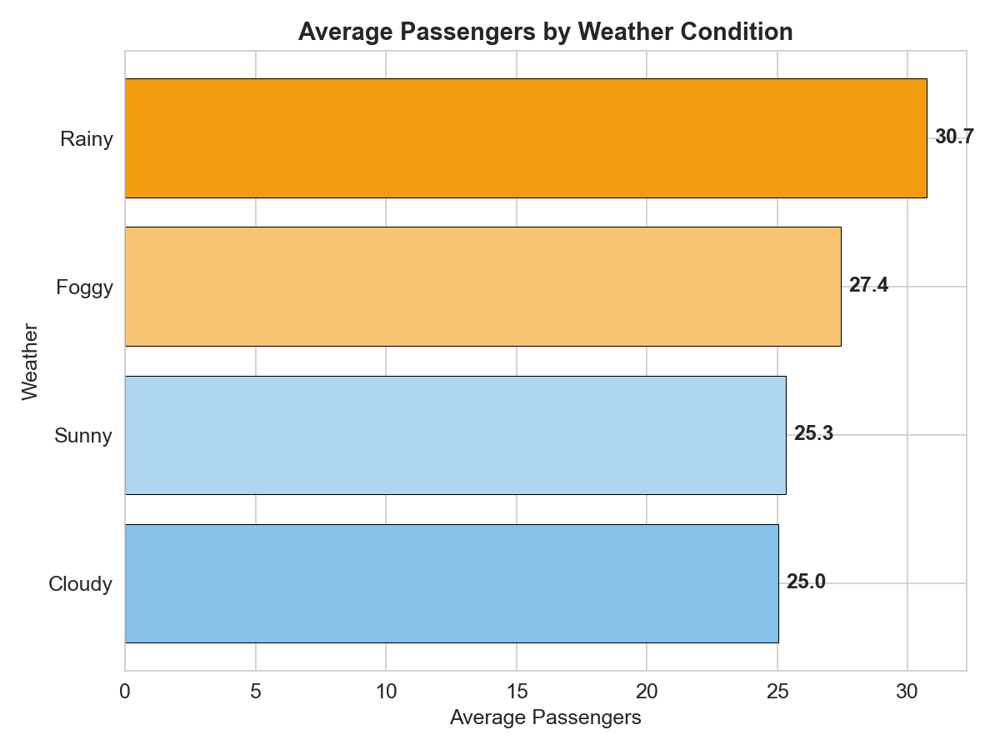

# Bus Rush Predictor 🚌

An AI-powered system that predicts bus rush levels on 
TSRTC Hyderabad routes using Machine Learning.

## Project Status
🟡 In Progress — Week 1 Complete

## Week 1 Progress
- ✅ Python OOP concepts learned and practiced
- ✅ Dataset generated (5000 rows, bus_data.csv)
- ✅ EDA completed with 4 charts
- ✅ GitHub set up with daily commits

## Tech Stack
- Python 3.14
- Pandas, NumPy
- Matplotlib, Seaborn
- Scikit-learn (coming Week 2)
- Flask (coming Week 3)

## Charts

### Rush Level Distribution

### Passengers by Hour

### Rush by Route

### Weather Impact

## Developer
Gayatri Chukka | B.Tech CSE AI/ML | 2nd Year